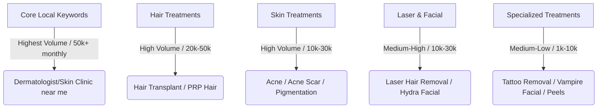

# SEO Keyword Research & GMB Optimization Report
**Client Name:** Ariix hair and skin clinic  
**Target:** Local SEO, Google Business Profile (GMB) optimization, and Website Copywriting  

---

## 1. Google Business Profile (GMB / GBP) Categories

Choosing the right categories is the single most critical ranking factor for Google Maps (Local Map Pack). Google allows one Primary category and up to nine Secondary categories.

### Primary Category
> [!IMPORTANT]
> **Primary Category: Dermatologist**  
> *Requirement:* This must only be used if the lead doctor/owner is a certified, board-registered Dermatologist (MD/DNB/Diploma in Dermatology). If the lead practitioner is a general physician or aesthetician, use **Skin Care Clinic** or **Medical Clinic** as the Primary category to avoid compliance flags.

### Secondary Categories
Select all of the following secondary categories to signal Google about the full service offerings of the clinic:
1. **Skin Care Clinic** (Essential fallback or secondary)
2. **Hair Transplantation Clinic** (Direct match for hair transplant services)
3. **Laser Hair Removal Service** (Direct match for laser treatments)
4. **Medical Spa** (Excellent for non-surgical facial treatments, chemical peels, and rejuvenations)
5. **Cosmetic Dermatologist** (Additional category for premium cosmetic/aesthetic treatments)
6. **Medical Clinic** (Provides general authority as a medical facility)
7. **Facial Spa** (Helps capture facial and skin rejuvenation queries)

---

## 2. SEO Search Volume Hierarchy

Keywords are categorized into search volume tiers based on general search trends in major cities. 



| Search Volume Tier | Keyword Categories | Average Intent |
| :--- | :--- | :--- |
| **Tier 1: High Volume (50K - 1M+)** | Broad Local Search ("dermatologist near me", "skin clinic nearby") | High (Transactional & Informational) |
| **Tier 2: Medium-High (10K - 50K)** | Laser Hair Removal, Hair Transplant, Hydra Facial, Acne Treatment, PRP Hair | Very High (Transactional / Booking Ready) |
| **Tier 3: Medium (1K - 10K)** | Dandruff, Acne Scars, Tattoo Removal, Vampire Facial, Chemical Peels, Vitiligo | High (Service-Specific Investigations) |
| **Tier 4: Niche (Under 1K)** | Medi Facial, Skin Polishing, Fruit/Carbon Peels, Oxy Hydra Facial | Ultra High (Highly Specific Intent) |

---

## 3. Line-by-Line Keyword Lists for Optimization

These lists are formatted to be used for website meta tags, service page headings, alt tags, and GMB service description copy. They include **"near me"**, **"nearby"**, and **"best"** modifiers to capture local intent.

### A. General Clinic & Core Local Keywords (Highest Volume)
dermatologist near me
best dermatologist near me
skin specialist near me
best skin specialist near me
skin clinic near me
best skin clinic near me
hair specialist near me
best hair clinic near me
skin care clinic nearby
dermatology clinic nearby
hair and skin clinic near me
best skin doctor near me
cosmetic dermatologist near me
aesthetic clinic nearby

### B. Hair Treatments (Ordered by Volume)

#### 1. Hair Transplant & Beard Transplant
hair transplant near me
best hair transplant clinic near me
hair transplant cost
hair transplant clinic nearby
hair transplantation doctor near me
beard transplant near me
beard transplant cost
best beard transplant clinic near me
hair transplant services nearby
beard hair transplant clinic near me

#### 2. PRP Hair Treatment
prp treatment for hair near me
prp hair treatment cost
best prp hair treatment clinic near me
prp hair therapy nearby
platelet rich plasma hair treatment near me
prp doctor for hair loss near me
hair prp cost nearby

#### 3. Hair Loss & Hair Fall Treatment
hair loss treatment near me
best hair loss clinic near me
hair fall treatment nearby
best hair fall doctor near me
hair loss treatment cost
hair thinning treatment near me
alopecia treatment clinic near me
hair regrowth treatment nearby

#### 4. Dandruff Treatment
dandruff treatment near me
best dandruff doctor near me
dandruff treatment clinic nearby
scalp treatment for dandruff near me
dandruff clinic near me

---

### C. Skin Treatments (Ordered by Volume)

#### 1. Acne & Acne Scar Treatment
acne treatment near me
best doctor for acne near me
acne scar treatment near me
laser acne scar removal cost
best acne scar treatment clinic near me
pimples treatment near me
acne scar removal nearby
pimple scar treatment near me

#### 2. Pigmentation & Dark Circle Treatment
pigmentation treatment near me
skin pigmentation treatment cost
best hyperpigmentation doctor near me
dark circle treatment near me
under eye dark circle removal near me
dark circle treatment cost
melasma treatment clinic near me
skin pigmentation removal nearby

#### 3. Mole & Skin Tag Removal
mole removal near me
skin tag removal near me
mole removal cost
best doctor for mole removal near me
laser skin tag removal nearby
mole clinic near me
warts and skin tag removal near me

#### 4. Vitiligo & Psoriasis Treatment
vitiligo treatment near me
vitiligo doctor near me
psoriasis treatment near me
best dermatologist for psoriasis near me
leukoderma treatment clinic near me
psoriasis clinic nearby

#### 5. Chemical Peel Treatment
chemical peel near me
chemical peel treatment cost
best chemical peel clinic near me
chemical peel for acne scars near me
glycolic acid peel treatment nearby
salicylic acid peel near me

---

### D. Laser Treatments (Ordered by Volume)

#### 1. Laser Hair Removal
laser hair removal near me
best laser hair removal clinic near me
laser hair removal cost
full body laser hair removal near me
laser hair reduction nearby
permanent hair removal cost
laser hair removal clinic nearby

#### 2. Laser Tattoo Removal
laser tattoo removal near me
tattoo removal cost
best tattoo removal clinic near me
permanent tattoo removal nearby
laser tattoo removal clinic near me

#### 3. Stretch Mark Removal
stretch mark removal near me
laser stretch mark removal cost
best stretch mark treatment near me
stretch mark removal clinic nearby
pregnancy stretch marks treatment near me

#### 4. Laser Skin Rejuvenation
laser skin rejuvenation near me
laser skin toning near me
carbon laser peel near me
laser skin whitening treatment cost
skin rejuvenation clinic nearby

---

### E. Facial Treatments & Skin Rejuvenation (Ordered by Volume)

#### 1. Hydra Facial & Oxy Hydra Facial
hydrafacial near me
hydrafacial cost
best hydrafacial clinic near me
hydra facial nearby
oxy hydra facial near me
photo facial near me
photo facial cost nearby

#### 2. Vampire Facial (PRP Facial)
vampire facial near me
prp facial treatment cost
vampire facial treatment nearby
platelet rich plasma facial near me
best vampire facial clinic near me

#### 3. Skin Polishing & Rejuvenation
skin polishing treatment near me
skin polishing and brightening near me
microdermabrasion near me
skin polishing cost nearby
skin rejuvenation treatment near me

#### 4. Medi Facial & Carbon Peel / Fruit Peel
medi facial near me
best medi facial clinic near me
carbon peel near me
fruit peel treatment near me
carbon laser facial nearby
chemical peel facial near me

---

## 4. Local SEO Implementation Blueprint

To rank "Ariix hair and skin clinic" for these terms, apply this 3-step blueprint:

1. **GMB Services Configuration:**
   - Under your GMB dashboard, navigate to **Services**.
   - Do not just write the name; add descriptions. Copy-paste the exact keywords above into the service descriptions. (e.g., for "Hair Transplant", describe it using "We offer the best hair transplant near me using modern FUE techniques, providing affordable hair transplant cost...").
   
2. **On-Page SEO Structure:**
   - Create individual pages for each core service (e.g., `/hair-transplant`, `/laser-hair-removal`, `/hydrafacial`). Do not bundle all skin/hair treatments onto a single page.
   - Use the **H1** tag: `Best [Treatment Name] in [City Name] | Ariix Hair & Skin Clinic`.
   - Use **H2** tags for local intent: `Affordable [Treatment Name] Cost in [City Name]` and `Why Choose Our [Treatment Name] Clinic Nearby?`.

3. **Local Citations & Reviews:**
   - Ask patients to leave reviews mentioning the *specific treatment names* and *location*. (e.g., "I went to Ariix for **laser hair removal** and **hydra facial** in [City Name] and the results were amazing!"). Google reads review text to match "near me" searches.

---

## 5. Master Content Framework: 10/10 SEO + AEO + GEO Checklist

> [!IMPORTANT]
> This framework is derived from a live content audit on the Ariix Hair and Skin Clinic treatment pages. Every new service page must pass ALL criteria below before publishing. This is the single source of truth for content generation.

---

### 5.1 The Three Scoring Pillars

| Pillar | Full Name | Weight | What it Optimises For |
|---|---|---|---|
| **SEO** | Search Engine Optimisation | 35% | Google rankings, meta tags, keyword targeting, URL structure, internal links |
| **AEO** | Answer Engine Optimisation | 35% | Featured snippets, People Also Ask, voice search, FAQ schema |
| **GEO** | Generative Engine Optimisation | 30% | AI citations (ChatGPT, Gemini, Perplexity), E-E-A-T signals, entity completeness |

---

### 5.2 Field-by-Field Content Rules

#### `metaTitle` *(SEO — Critical)*
- **Length:** 50–60 characters (never exceed 60)
- **Format:** `Best [Treatment Name] in Pune | [Key Differentiator] near me`
- **Rules:**
  - Must contain the primary keyword in the first 5 words
  - Must contain either "near me" OR the city name (never both — use one)
  - Include a power word: Best / Advanced / Clinical / Expert / Certified
  - Each page must have a UNIQUE title — no two pages can share the same format
- **Examples:**
  - ✅ `Best Laser Hair Removal in Pune | Permanent Reduction near me`
  - ✅ `PRP Hair Treatment in Pune | Non-Surgical Hair Regrowth Cost near me`
  - ❌ `Hair Fall Treatment in Pune | Hair Fall Doctor near me` ← (too similar to Hair Loss page = cannibalization)

---

#### `metaDescription` *(SEO — Critical)*
- **Length:** 150–160 characters exactly
- **Must include ALL of:**
  1. **Doctor name**: Dr. Abhimanyu Jagtap Waghmare
  2. **Clinic name**: ARIIX HAIR AND SKIN CLINIC
  3. **The specific procedure differentiator** (e.g., "Diode Laser 810nm", "Q-Switch Nd:YAG", "FUE", "double-spin PRP")
  4. **Location**: at least one of — Kharadi, Sinhagad Road, Pune, Wagholi
  5. **CTA verb**: Book now / Consult today / Schedule / Call today
- **Rules:**
  - NO generic phrases like "affordable cost" or "FDA-approved" without context
  - Each page description must be entirely unique — no sentence shared between pages
  - Write for humans first, Google second

---

#### `h1Lines` *(SEO — Critical)*
- **Format:** 2-line array: `["[Treatment Name]", "in Pune"]`
- **Rules:**
  - Line 1: The primary keyword only. No clinic name.
  - Line 2: Location ("in Pune") or sub-location for niche pages ("in Viman Nagar", "in Kharadi")
  - H1 must match the primary keyword in the metaTitle exactly

---

#### `heroBadge` *(SEO — Minor)*
- 3–5 words. Describe the clinical approach or USP.
- Examples: "Dermatologist-led laser therapy", "Non-surgical hair restoration", "Clinical scalp hygiene"

---

#### `heroIntro` *(SEO + GEO — Important)*
- **Length:** 1–2 sentences, 30–50 words
- **Must be DIFFERENT from `ogDescription`** — never copy-paste between the two
- **Contain:** The primary treatment keyword + a specific clinical detail + patient benefit
- **Rule:** If `ogDescription` focuses on features, `heroIntro` should focus on the patient outcome
- **Example:**
  - ogDescription: "Restore your hair volume with customized medical protocols" 
  - heroIntro (correct): "Sudden or excessive hair shedding from stress or nutritional deficiencies is clinically treatable. Dr. Abhimanyu identifies the exact trigger and reverses hair fall with a targeted, evidence-based protocol."

---

#### `overviewParagraphs` *(SEO + GEO — Most Important for AI Citations)*
- **Paragraph 1 — THE WHAT:**
  - Explain the treatment mechanism using clinical terminology
  - Name the specific technology/technique (e.g., "Follicular Unit Extraction (FUE)", "Q-Switch Nd:YAG laser at 1064nm", "Platelet-Rich Plasma double-spin centrifugation")
  - Include the biological mechanism (how it actually works at a cellular level)
  - Name growth factors, wavelengths, skin layers, follicle stages, acid names — whatever is relevant
  - **GEO Rule:** Specificity = citation-worthiness. Generic = invisible to AI.

- **Paragraph 2 — THE WHO + AUTHORITY:**
  - **MANDATORY: Name the doctor**: "Dr. Abhimanyu Jagtap Waghmare (BAMS, PGDEMS, PGDCC)"
  - Include a **cited statistic or prevalence figure** (e.g., "According to the Indian Journal of Dermatology...", "Clinical studies confirm...", "Data from ISHRS shows...")
  - Include at least 2 **location keywords** naturally (e.g., "Kharadi", "Sinhagad Road", "Wagholi", "near me in Pune")
  - End with a patient-benefit statement

---

#### `reasons` *(E-E-A-T — GEO)*
- 4 reason cards minimum
- **Reason card 1 MUST:** title includes "Dr. Abhimanyu" and text includes full credentials (BAMS, PGDEMS, PGDCC) + years of experience
- Other cards: Specific to the technology or technique (NOT generic "expert team" or "modern equipment")
- Each text must be 1–2 sentences of **specific clinical information**, not marketing fluff

---

#### `steps` *(AEO — Featured Snippet Ready)*
- 5–6 steps minimum
- Each step title must be a **noun phrase** (e.g., "Skin Phototype Assessment", "Cooling Gel Application")
- Each step text: 1–2 sentences, process-specific, includes clinical detail (e.g., fluence levels, contact time, device name)
- **AEO Rule:** Steps sections are one of the top featured-snippet triggers. They must be scannable and self-explanatory.

---

#### `procedureNote` *(AEO — Quick Answer Trigger)*
- `procedureNoteTitle`: Must be a **question** that patients commonly ask (e.g., "Is laser hair removal permanent?", "Is it painful?")
- `procedureNoteText`: 2–3 sentences, direct factual answer, include a specific timeframe or statistic if possible
- **AEO Rule:** This note is ideal for voice search and zero-click answers.

---

#### `faqs` *(AEO — Highest Priority for Featured Snippets)*
- **Minimum 7 FAQs** per page. Recommended: 8–9.
- **MANDATORY FAQ categories (must have all):**
  1. 💰 **Cost FAQ** — Specific INR range with variables (e.g., "₹2,000–₹8,000 per session depending on area size")
  2. 🕐 **Sessions FAQ** — How many sessions, how far apart, total duration
  3. ⏱️ **Results Timeline FAQ** — When to expect results, month-by-month if relevant
  4. 😣 **Pain/Comfort FAQ** — Be honest, include numbing options
  5. ⚠️ **Side Effects FAQ** — Realistic, include downtime
  6. ⚖️ **Comparison FAQ** — Compare to an alternative (e.g., laser vs waxing, FUE vs FUT, PRP vs minoxidil)
  7. 📍 **Local FAQ** — "Can I get [treatment] at [Kharadi/Sinhagad Road]?" — confirms availability
  8. ✅ **Candidacy/Eligibility FAQ** — "Am I a good candidate?" or "Who should not get this?"
- **FAQ answer rules:**
  - 3–6 sentences each
  - Direct answer in sentence 1 (Google reads first sentence for featured snippet)
  - Include specific data: numbers, timelines, INR ranges, wavelengths, session counts
  - End with a clinic-specific call to action where natural
  - **Never** start an answer with "It depends" — qualify but be specific

---

#### `benefits` *(SEO — Page Completeness)*
- 6–8 bullet points minimum
- Mix functional benefits (permanent reduction, no scarring) + lifestyle benefits (confidence, time-saving) + clinical benefits (safe for skin type)
- No two benefits should be synonyms of each other

---

#### `internalLinks` *(SEO — Crawlability + Topic Cluster)*
- 4 links minimum
- Must include:
  - 1 cross-treatment link (related treatment the same patient might consider)
  - 1 contact/booking link (`/contact-us`)
  - 1 results/social proof link (`/gallery` or `/testimonials`)
  - 1 educational hub link (`/treatment`)
- **Topic Cluster Rule:** Laser pages should cross-link to each other. Hair pages should cross-link to each other. Build topic clusters, not isolated pages.

---

#### `structuredHowPerformed` *(GEO — AI Schema Rich Snippet)*
- 2–4 sentences
- **MUST INCLUDE ALL:**
  1. Doctor name (Dr. Abhimanyu Jagtap Waghmare)
  2. Specific technology/device name
  3. Wavelength in nm (if laser) OR specific technique name (if non-laser)
  4. The biological mechanism (what happens to tissue)
  5. The clinical outcome (what the patient gains)
- **GEO Rule:** This field populates the MedicalProcedure JSON-LD schema. AI systems like Gemini parse JSON-LD directly — this is your #1 AI citation signal.
- **Example (good):** "Dr. Abhimanyu Jagtap Waghmare administers Q-Switch Nd:YAG laser pulses at 532nm (visible ink) and 1064nm (deep/dark ink) wavelengths. The photoacoustic effect shatters tattoo pigment into micro-particles, which the body's lymphatic system naturally eliminates over 4–8 weeks. Sessions are spaced 6–8 weeks apart to allow full immune clearance."
- **Example (bad):** "Laser is used to remove the tattoo through a series of sessions."

---

### 5.3 Keyword Cannibalization Prevention Rules

> [!WARNING]
> Keyword cannibalization occurs when two pages on the same site target the same keyword. Google will rank only one, harming both. Follow these rules strictly.

| Treatment Pair | Rule |
|---|---|
| Hair Fall vs Hair Loss | Hair Fall = Telogen Effluvium (sudden, acute, reversible). Hair Loss = Androgenetic Alopecia (progressive, genetic). metaTitles MUST reflect this distinction. |
| Laser Hair Removal vs Laser Skin Rejuvenation | Hair Removal = permanent reduction of unwanted hair. Skin Rejuvenation = pigmentation, texture, pores, toning. Never use "laser skin" in the hair removal title. |
| PRP Hair vs PRP Facial (Vampire Facial) | Specify "PRP Hair Treatment" vs "PRP Facial" — never just "PRP Treatment" for either page. |
| Acne Treatment vs Acne Scar Treatment | These are separate patient journeys — separate pages, separate metaTitles. |

---

### 5.4 E-E-A-T (Expertise, Experience, Authoritativeness, Trustworthiness) Checklist

Google's Quality Rater Guidelines require E-E-A-T signals for medical content (YMYL = Your Money or Your Life). Every page must satisfy:

| Signal | Implementation |
|---|---|
| **Experience** | "17+ years of clinical experience" in reasons card. Include patient-specific language ("most patients notice...") |
| **Expertise** | Doctor name + credentials (BAMS, PGDEMS, PGDCC) in overviewParagraphs[1] AND reasons[0] |
| **Authoritativeness** | Cite external authority: ISHRS / Indian Journal of Dermatology / published clinical data / named medical associations |
| **Trustworthiness** | Realistic side effects, honest "who is NOT a candidate" FAQ, realistic timelines and cost ranges |

---

### 5.5 GEO (Generative Engine Optimisation) — AI Citation Readiness

AI systems (ChatGPT, Gemini, Perplexity, Claude) use these signals to decide whether to cite a page:

| GEO Signal | Required On Every Page | Examples |
|---|---|---|
| **Named practitioner** | ✅ Mandatory | "Dr. Abhimanyu Jagtap Waghmare (BAMS, PGDEMS, PGDCC)" |
| **Specific clinical data** | ✅ Mandatory | Cost ranges, session counts, wavelengths, timelines |
| **Location specificity** | ✅ Mandatory | "Kharadi", "Sinhagad Road", "Wagholi", "Pune" |
| **Medical entity depth** | ✅ Mandatory | Named fungus species, growth factors, laser wavelengths, acid types |
| **External citation** | ✅ At least one per page | ISHRS, Indian Journal of Dermatology, WHO, AAD |
| **Freshness signal** | ⚠️ Recommended | "Updated per [Organisation] 2024 guidelines" |
| **JSON-LD schema** | ✅ Via structuredHowPerformed | MedicalProcedure schema renders in `<head>` |

---

### 5.6 The 10/10 Final Scoring Rubric

Use this rubric to self-verify any page before publishing:

| Check | Points | Pass Criteria |
|---|---|---|
| metaTitle is 50–60 chars, unique, primary keyword first | 1 | Yes / No |
| metaDescription 150–160 chars, includes doctor name + location + CTA | 1 | Yes / No |
| heroIntro is different from ogDescription | 1 | Yes / No |
| overviewParagraphs[0] has specific technology + mechanism | 1 | Yes / No |
| overviewParagraphs[1] names the doctor + has a statistic | 1 | Yes / No |
| reasons[0] names Dr. Abhimanyu + BAMS, PGDEMS, PGDCC + 17 years | 1 | Yes / No |
| 7+ FAQs covering all mandatory categories (cost, sessions, timeline, pain, side effects, comparison, local) | 1 | Yes / No |
| 4 internalLinks including cross-treatment, contact, gallery, hub | 1 | Yes / No |
| structuredHowPerformed names doctor + technology + wavelength + mechanism + outcome | 1 | Yes / No |
| No keyword cannibalization with any other page on the site | 1 | Yes / No |
| **TOTAL** | **10** | **All 10 = Publish** |

> [!CAUTION]
> If any single check fails, do NOT publish the page. Fix the gap first. A partial score of 9/10 still leaves a GEO or AEO blind spot that will cost rankings over time.

---

### 5.7 Content Generation Prompt Template

Use this when generating new service pages (for AI tools or human writers):

```
Generate a complete TreatmentPageData object for [TREATMENT NAME] at ARIIX HAIR AND SKIN CLINIC, Pune.

Doctor: Dr. Abhimanyu Jagtap Waghmare (BAMS, PGDEMS, PGDCC), 17+ years
Branches: Kharadi (Sundays 12–8 PM) | Sinhagad Road (Mon–Sat 10:30 AM–2 PM, 5:30–9 PM)
Technology used: [SPECIFY: Diode Laser / Q-Switch Nd:YAG / CO2 Fractional / IPL / etc.]
pagePath: /[url-slug]

MANDATORY REQUIREMENTS:
1. metaDescription must include doctor name, clinic name, technology, location, CTA (150–160 chars)
2. overviewParagraphs[0]: Explain mechanism with technology name + wavelength + biological action
3. overviewParagraphs[1]: Name the doctor + cite a statistic + include location keywords
4. reasons[0]: Must include "Dr. Abhimanyu" in title, credentials + 17 years in text
5. Minimum 7 FAQs covering: cost (INR range), sessions, timeline, pain, side effects, comparison, local availability
6. structuredHowPerformed: doctor + technology + wavelength + mechanism + outcome (3–4 sentences)
7. internalLinks: 4 links — cross-treatment + contact + gallery + treatment hub
8. heroIntro must be DIFFERENT from ogDescription
9. Cite an external authority (ASLMS / ISHRS / Indian Dermatology / AAD) in overviewParagraphs[1]
10. No keyword cannibalization — check existing pages before writing metaTitle
```

---

*This framework was built and validated through live content optimisation of the Ariix Hair and Skin Clinic treatment pages — June 2026.*

